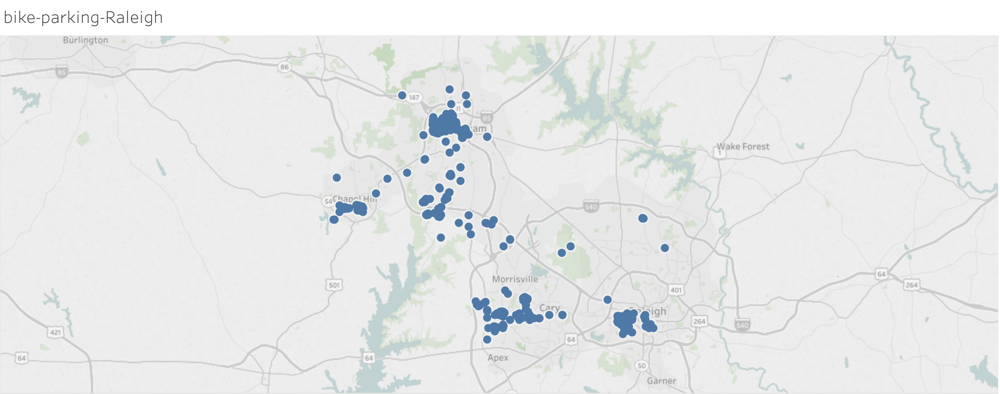

# OpenStreetMap Data Quality Analysis

### Area of interest : Raleigh, North Carolina, US
This map is of a city that I used to live, so I’m quite interested to see what
database querying reveals. Sources of data:
- [https://mapzen.com/data/metro-extracts/metro/raleigh_north-carolina/]
(https://mapzen.com/data/metro-extracts/metro/raleigh_north-carolina/)
- [https://www.openstreetmap.org/relation/179052]
(https://www.openstreetmap.org/relation/179052)

## Problems Encountered in the Map
I started out by looking at a smaller sample of this region first and used
sample.py to generate a sample of elements from the original OSM. After the
scripts for each aspect are completed, the full size map  is then run against:

- audit.py - examining the data quality
- data.py  - loading the data, iterative parsing, writing the output to csv
files
- db.py - uploading csv files programmatically to an SQLite database, and
storing them as tables, respectively.

Several problems with the data set are found:

1. Missing spaces upon entering *("LaurelcherryStreet")*
2. Extra information included the street names *("Westgate Park Dr #100",
"Barrett Dr Suite 206", "Fayetteville St #1100")*
3. Inconsistent postal codes *("277030", "27713-2229", "28616")*
4. Typos in the city names *(Morrisville is mis-spelled as Morisville)*

### Inconsistent post codes
To standardize the postal codes, the following codes are inserted into data.py
to convert all the postal codes into a basic 5-digit format.

Defining a function to update the postal codes:

``` python
def update_postcode(postcode):
    # ref. https://discussions.udacity.com/t/cleaning-postcode/195512/6
    search = re.match(r'^\D*(\d{5}).*', postcode)
    clean_postcode = search.group(1)
    return clean_postcode
```
Incorporating update_postcode() into shape_element() function in data.py:

``` python
def shape_element():
    ...
    # start cleaning:
    # Street name
    if child.attrib["k"] == 'addr:street':
        tag_dict["value"] = update_name(child.attrib["v"], mapping)
    # Postcodes
        elif child.attrib["k"] == 'addr:postcode':
            tag_dict["value"] = update_postcode(child.attrib["v"])
        else:
            tag_dict["value"] = child.attrib["v"]
    # end cleaning
    ...
```
Another function update_name(), which updates the street name, is incorporated
into shape_element() function as well.

# Data Overview and Exploration
This section contains basic statistics and exploration of the dataset, and sql
queries used to gather the information are listed as well.

### File sizes
```
raleigh_north-carolina.osm .... 482 MB
mydb.db ....................... 266 MB
nodes.csv ..................... 190 MB
nodes_tags.csv ................ 2.1 MB
ways.csv ...................... 13 MB
ways_nodes.cv ................. 63 MB
ways_tags.csv ................. 30 MB
```
Five csv files are loaded into mydb database and therefore, there are five
tables available for the sql analysis. Here are some brief explanation of what
each of them represents in a map:

1. nodes_path (from "nodes.csv") - a specific point on the earth's surface
defined by its latitude and longitude
2. ways_path (from "ways.csv") - a way is an ordered list of between
2 and 2,000 nodes, which are used to represent linear features such as rivers
and roads, and the boundaries of areas such as buildings or forests.
3. node_tags_path (from "nodes_tags.csv") - all types of data element (nodes,
  ways) can have tags. Tags describe the meaning of the particular element to
  which they are attached, such as the function of the road, the facilities,
  etc.
4. way_nodes_path (from "ways_nodes.csv")
5. way_tags_path (from "ways_tags.csv")

### Number of nodes
```sql
sqlite> SELECT COUNT(*) FROM nodes;
```
```sql
2374920
```
Count(*) function returns the number of the record in the table nodes.

### Number of ways
```sql
sqlite> SELECT COUNT(*) FROM ways;
```
```sql
243842
```
It is reasonable that there are more nodes than ways in a map based on what they
represent.

### Number of unique users ()
```sql
sqlite> SELECT COUNT(DISTINCT(e.uid))          
FROM (SELECT uid FROM nodes UNION ALL SELECT uid FROM ways) e;
```
```sql
1019
```

Since the contributors of nodes and ways could be from different users, we
use UNION ALL to select the distinct values, giving the number of unique users.
Note that in this nested query, a table alias e (representing the new table
  which combines the uid from nodes and ways) is used, and AS is omitted.

### Number of users appearing only once (having 1 post)
```sql
sqlite> SELECT COUNT(*)
FROM
    (SELECT e.user, COUNT(*) as num
     FROM (SELECT user FROM nodes UNION ALL SELECT user FROM ways) e
     GROUP BY e.user
     HAVING num=1)  u;
```

```sql
199
```
A nested subquery is used to obtain the result. At first, the innermost query
retrieves all the users that appear in either nodes or ways. The middlemost then
selects those only appear once. The outermost query counts the number of such
users. Note that a column alias num is used to represent the new variable
count(*), the number of the record in the table e.

### Sort cities by count, descending
```sql
sqlite> SELECT tags.value, COUNT(*) as count
FROM (SELECT * FROM nodes_tags UNION ALL
      SELECT * FROM ways_tags) tags
WHERE tags.key == 'city'
GROUP BY tags.value
ORDER BY count DESC;
```
And the results are shown below:

```sql
Raleigh      6830
Cary         3119
Morrisville  1732
Durham       1674
Chapel Hill  625
Carrboro     503
Research Triangle Park 6
Hillsborough 5
RTP          4
raleigh      4
chapel Hill  3
Chapel Hill, NC 2
Wake Forest  2
cary         2
durham       2
 Raleigh     1
Apex         1
Morisville   1
Ralegh       1
Ralegih      1
chapel hill  1
```
Firstly, the major cities in the triangle are (Raleigh-Durham-Chapel Hills) are
included in this data set. Thus, it contains not only the city of Raleigh but
also the nearby cities. Secondly, it is visible that there are several
variations of names of the same city (e.g. "Chapel Hill", "chapel Hill", Chapel
Hill, NC", "chapel hill").

### Top 10 amenities

```sql
sqlite> SELECT value, COUNT(*) as num
FROM nodes_tags
WHERE key='amenity'
GROUP BY value
ORDER BY num DESC
LIMIT 10;
```

```sql
bicycle_parking  1146
restaurant       924
place_of_worship 742
fast_food        366
bench            264
waste_basket     250
cafe             194
atm              156
school           152
parking          144
```
It is surprising to find out that there are many bicycle parking lots in this
area. It is possible these parkings are around the campuses for the students,
who ride bikes in their campuses.

To do a test to see whether these parkings are around the campus, a another set
queries are run in Python to pull out the locations of the parkings. The result
is plotted in Tableau as shown below.



Actually, there are quite a number of parkings in Cary and Morrisville, which
have no colleges, but are mainly for residential use. So it is good to know that
this area provides lots of parkings for bicycle lovers.

The code to generate the location of the parkings is as follows:

```python
query = ("CREATE TABLE result AS \
         SELECT nodes.id, \
         nodes.lat, \
         nodes.lon, \
         nodes_tags.value \
          FROM nodes INNER JOIN nodes_tags \
                  ON nodes.id = nodes_tags.id")
cur.execute(query)
cur.fetchall()

query = ("SELECT * FROM result \
         WHERE value = 'bicycle_parking'")
cur.execute(query)
bike=pd.DataFrame(cur.fetchall())
```

### Top 10 shops

```sql
sqlite> SELECT value, COUNT(*) as num
FROM nodes_tags
WHERE key='shop'
GROUP BY value
ORDER BY num DESC
LIMIT 10;
```

```sql
clothes     198
supermarket 186
hairdresser 118
vacant      88
beauty      74
car_repair  60
jewelry     58
department_store 54
gift        48
art         42
```

# Additional Ideas

## Contributor statistics
### Top 10 contributing users
```sql
sqlite> SELECT e.user, COUNT(*) as num
FROM (SELECT user FROM nodes UNION ALL SELECT user FROM ways) e
GROUP BY e.user
ORDER BY num DESC
LIMIT 10;
```
```sql
jumbanho        1552751
JMDeMai         219489
bdiscoe         129500
woodpeck_fixbot 112193
bigal945        103601
yotann          66555
runbananas      41249
BjornRasmussen  37676
sandhill        33495
MikeInRaleigh   30578
```

Based on the result above, it is easy to note that,
- The top user "jumbanho" makes a significant contribution, which is larger than
 65%.
- The top 5 users corporately contribute to 80% of the data.
- The rest of the users, 99.5% of all users, only contribute to 20% of the data
corporately.

It is understandable that certain users are more passionate about the
OpenStreetMap project, and therefore contribute more to the data input. However,
 because data input is dominant by a particular group of people, it is possible
 the data entry could be skewed.
To alleviate this issue, the OpenStreetMap project could potentially set an
upper limit for the contribution from each user. In addition, if the map data of
 an area is largely provided by an user, a reminder could be posted as a
 headline, indicating that this set of data may be biased potentially. This
 could be an incentive to other users to contribute more to normalize the users
 contribution, and a gereral warning to whoever considering to use the data.
 A potential drawback could be the delay of building complete data sets because
 of the limit for the contribution from each user.

# Conclusion
This review provides a general overlook of the geography information in Raleigh
area, and certain entry errors have been be identified as well. In addition, the
 street names and the postal codes are standardized to improve the data quality.
  The data in this map is largely supplied by few users, which could possibly
  lead to bias information, and a possible solution is suggested.
